# OpenPalantir 效果展示

本文档展示 OpenPalantir 各功能页面的实际运行效果。

---

## 1. 文档管理

支持上传 PDF、Word、Markdown、图片等多种格式文档，自动解析文本并生成摘要树，可一键触发 LLM 实体提取与关系识别。

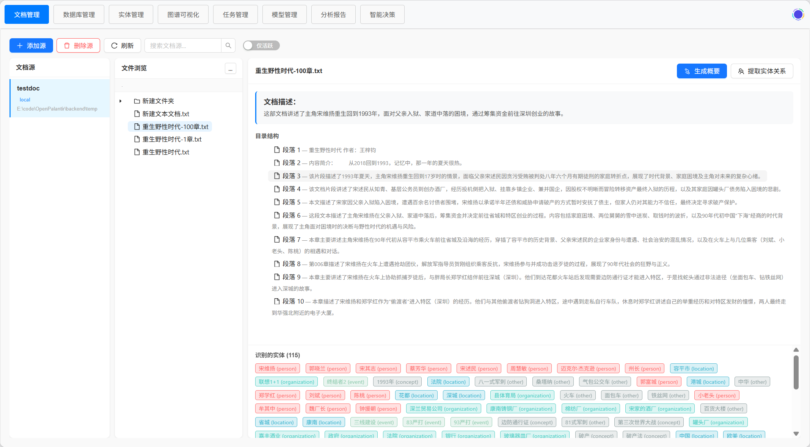

---

## 2. 数据库管理

支持连接 MySQL、PostgreSQL、SQLite 等外部数据库，自动提取 Schema 并通过 LLM 进行业务标注，后续可将表数据逐行导入知识图谱。

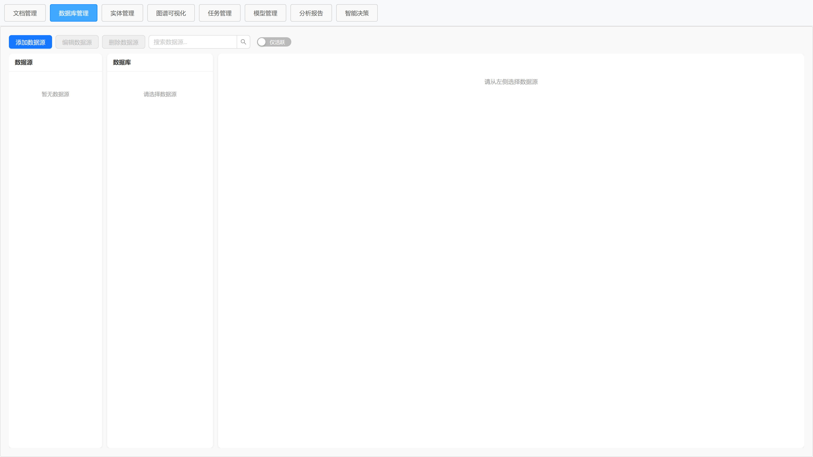

---

## 3. 实体管理

展示所有已提取的实体，支持按类型筛选、关键词搜索、分页浏览。点击实体可查看详细属性、别名、关联关系及数据来源。

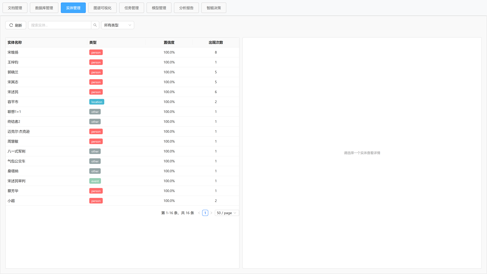

---

## 4. 图谱可视化

基于 3D 力导向图展示知识图谱全景，支持节点拖拽、缩放旋转、按实体类型和置信度过滤，点击节点查看关联关系详情。

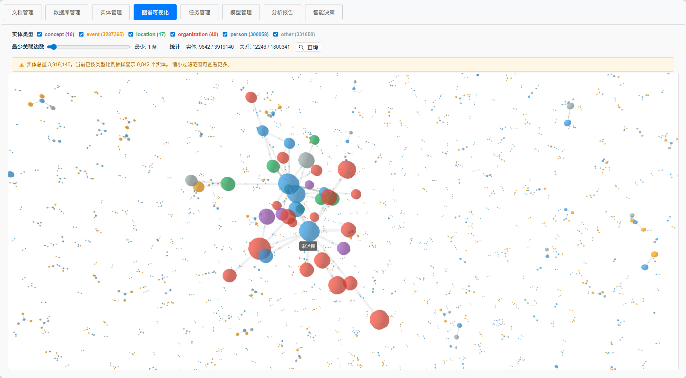

---

## 5. 任务管理

统一的异步任务管理中心，支持创建文档解析、实体提取、数据库导入等任务，实时追踪任务状态与进度。

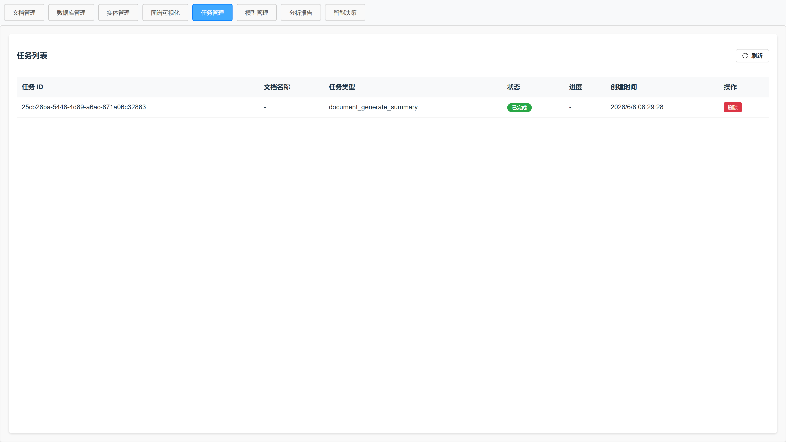

---

## 6. 模型管理

管理 LLM 模型配置，支持 Ollama 本地模型及 OpenAI / DeepSeek / SiliconFlow 等云端 API，可测试连接并启用/禁用模型。

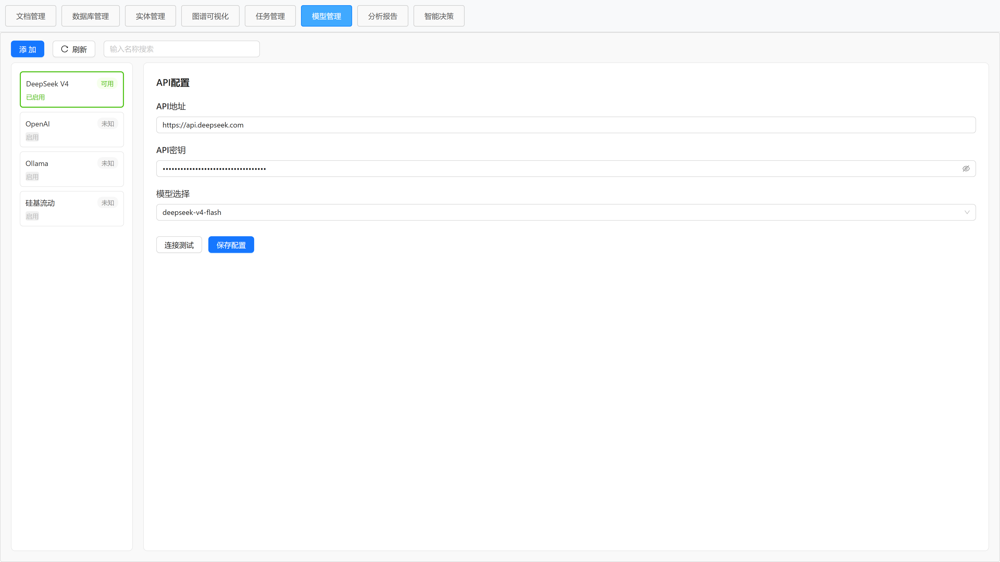

---

## 7. 分析报告

图谱分析引擎提供四种分析模式：

### 7.1 路径分析

查找两个实体之间的最短路径或 K 条最短路径，支持加权路径计算。

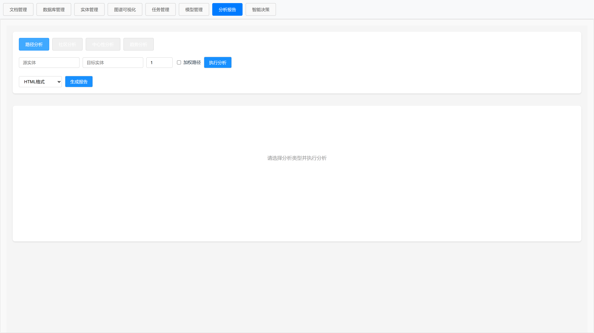

### 7.2 社区分析

基于 Louvain 算法进行社区发现，识别图谱中的紧密群体结构。

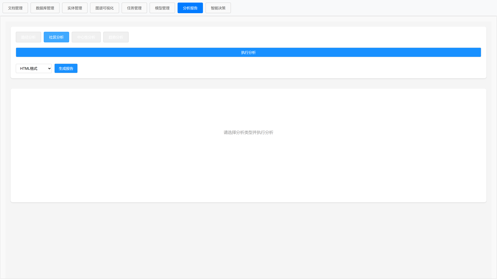

### 7.3 中心性分析

计算节点的度中心性、介数中心性、紧密中心性、PageRank 和特征向量中心性。

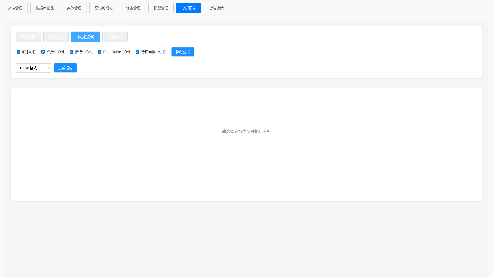

### 7.4 趋势分析

按时间维度分析实体数量、关系数量、社区数量和中心性指标的变化趋势。

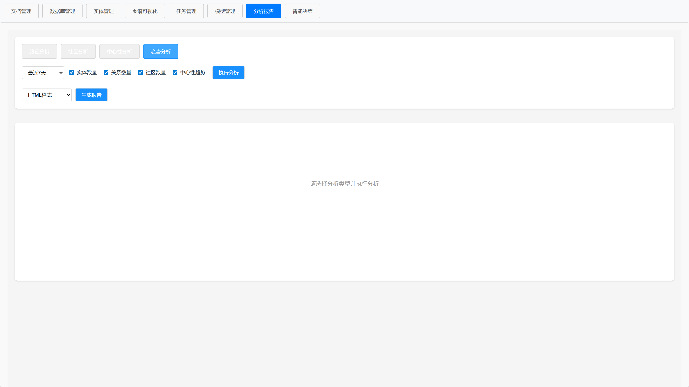

---

## 8. 智能决策

插件化架构的智能决策助手，可结合知识图谱与数据库进行问答型决策分析。支持多轮对话，自动关联上下文。

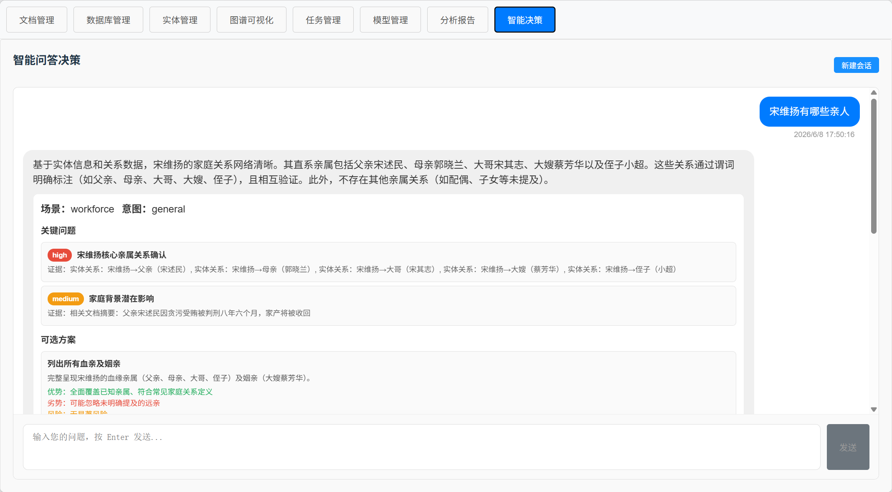
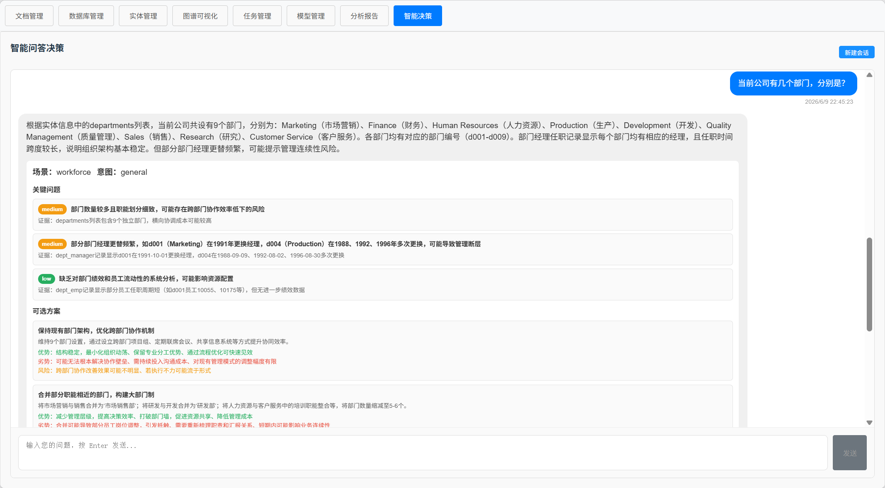

---

> 以上截图基于 OpenPalantir 当前开发版本，实际界面可能随版本更新有所变化。
